<div align="center">



<a href="https://github.com/gowdaanup73-pixel">
  
</a>

<br/>

<a href="https://myportfolio-beta-gray.vercel.app/"></a>
<a href="https://www.linkedin.com/in/anup-gowda-k-t/"></a>
<a href="https://www.instagram.com/anup___7/"></a>

</div>

<br/>

<div align="center">
<sub><code>CLICK A COMMAND TO RUN IT</code></sub>
</div>

<br/>

<details>
<summary><code>❯ whoami</code></summary>

<br/>

```
┌────────────────────────────────────────────────────────────┐
│  NAME     Anup Gowda K T                                   │
│  ROLE     Software Engineer                                │
│  CLASS    2027                                             │
│  BASE     India                                            │
│  STATUS   ● building                                       │
│                                                            │
│  I write software, chase clean ideas, and turn messy       │
│  problems into things people actually want to use.         │
└────────────────────────────────────────────────────────────┘
```

</details>

<details>
<summary><code>❯ ls ./projects</code></summary>

<br/>

<table>
  <tr>
    <td width="50%" valign="top">
      <a href="https://github.com/gowdaanup73-pixel/maritime">
        
      </a>
    </td>
    <td width="50%" valign="top">
      <a href="https://github.com/gowdaanup73-pixel/maritime-ai">
        
      </a>
    </td>
  </tr>
</table>

```
→ maritime        full-stack maritime logistics platform
→ SanathSanchari  travel-focused web project
→ Registration    clean registration flow
```

[`browse all repositories →`](https://github.com/gowdaanup73-pixel?tab=repositories)

</details>

<details>
<summary><code>❯ cat stack.txt</code></summary>

<br/>

<div align="center">
  
</div>

</details>

<details>
<summary><code>❯ ping anup</code></summary>

<br/>

```
PING anup.gk (portfolio) ...
64 bytes: reply received  time=<1ms

→ portfolio  https://myportfolio-beta-gray.vercel.app/
→ linkedin   in/anup-gowda-k-t
→ instagram  @anup___7

Open to good conversations and better ideas.
```

</details>

<details>
<summary><code>❯ sudo unlock --secret</code></summary>

<br/>

```
[sudo] password for visitor: ********
ACCESS GRANTED

        ▄▄▄▄▄▄▄▄▄▄▄▄▄▄▄▄▄▄▄▄▄▄▄▄▄▄
        █  "Make it work.          █
        █   Make it right.         █
        █   Make it feel inevitable."
        ▀▀▀▀▀▀▀▀▀▀▀▀▀▀▀▀▀▀▀▀▀▀▀▀▀▀
                    — a.gk

You found the hidden layer. Nice. Say hi.
```

</details>

<br/>

<div align="center">

<sub><code>◢ CONTRIBUTION SIGNAL — THE SNAKE IS HUNGRY ◣</code></sub>

<picture>
  <source media="(prefers-color-scheme: dark)" srcset="https://raw.githubusercontent.com/gowdaanup73-pixel/gowdaanup73-pixel/output/github-snake-dark.svg" />
  <source media="(prefers-color-scheme: light)" srcset="https://raw.githubusercontent.com/gowdaanup73-pixel/gowdaanup73-pixel/output/github-snake.svg" />
  
</picture>

<br/>


</div>
